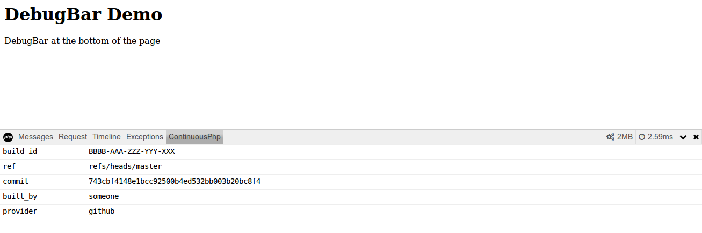

# Debug bar information about continuousphp build

Adding information from package build by [continuousphp](https://continuousphp.com/) on the [php debugbar](http://phpdebugbar.com/).

On continuousphp, when you have a package, it comes with a nice json file `continuousphp.package` that contains interesting values.
So let's print them in the debugbar.

## Install & configuration

```
composer require --dev grummfy/php-debugbar-continuousphp
```

Then add to your debugbar :

```
$debugbar->addCollector(new Grummfy\DebugBar\ContinuousphpCollector('path/to/continuousphp.package'));
```

### Integration to other debug bar

On any bar based on php-debugbar, it will be the same.

An example with [laravel](https://github.com/barryvdh/laravel-debugbar):

```
Debugbar::addCollector(new Grummfy\DebugBar\ContinuousphpCollector('path/to/continuousphp.package'));
```

Personally I add it inside an AppServiceProvider inside the providers directory.

## Demo

To get a simple demo, go to demo dir and run
```
composer install
php -S localhost:8080
```
Open your browser to [http://localhost:8080](http://localhost:8080) .

You should see this


